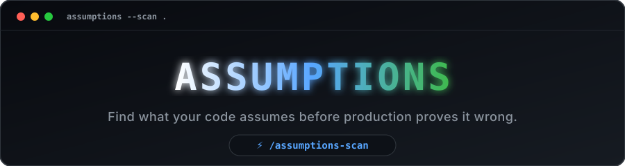
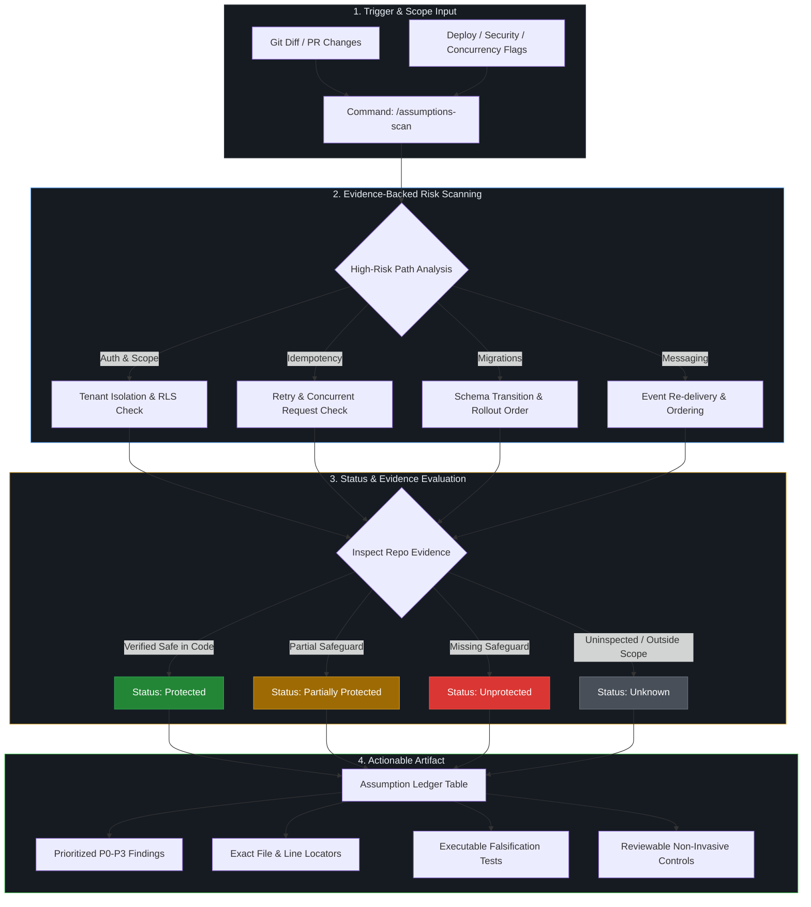

<div align="center">
  <a href="https://github.com/Teycir/Assumptions">
    
  </a>
</div>

<br>

<p align="center">
  <a href="#-use-cases">Features</a> •
  <a href="#-how-it-works">How It Works</a> •
  <a href="#installation">Installation</a> •
  <a href="#usage">Usage</a> •
  <a href="#example">Examples</a>
</p>

<p align="center">
  <a href="LICENSE"></a>
  <a href="#installation"></a>
  <a href="#installation"></a>
  <a href="#installation"></a>
  <a href="#privacy-and-cost"></a>
  <a href="#installation"></a>
  <a href="#why-not-just-ask-your-ai-assistant-to-review-this"></a>
  <a href="#use-cases"></a>
  <a href="#usage"></a>
</p>

<br>

<p align="center">
  
</p>

<p align="center">
  ▶️ <b><a href="https://youtu.be/N6CU-brB83M">Click to watch the full demo video</a></b>
</p>

<br>

Turn a diff into an evidence-backed **Assumption Ledger**: the conditions
that must hold, the repository evidence behind each one, what breaks if
it's wrong, and the fastest test to settle each question. It scopes its
review, prioritizes the highest-risk paths, and states what it could not
inspect — rather than promising to cover everything in a fixed amount of
time.

Most production failures are not caused by obviously broken code.

They happen because a change silently assumes something will remain true:

- "This request is only processed once."
- "The migration deploys before the worker."
- "That API field is never absent."
- "Events always arrive in order."
- "This record belongs to the current tenant."
- "A user cannot click the button twice."

Assumptions asks one question:

> **What must be true for this change not to break in production?**

It then produces a reviewable artifact:

- the assumption, phrased as a condition
- evidence in the repository, with a file/line locator where available
- what breaks if it is false
- a status (Protected / Partially protected / Unprotected / Unknown)
- a test or procedure to falsify it
- a recommended control
- an evidence confidence label and a release priority

---

## 📑 Table of Contents

- [How It Works](#-how-it-works)
- [Why not just ask your AI assistant?](#why-not-just-ask-your-ai-assistant-to-review-this)
- [Use Cases](#-use-cases)
- [Example](#example)
- [Installation](#installation)
- [Usage](#usage)
- [Limits](#limits)
- [Contributing](#contributing)
- [License](#license)

---

## 🔄 How It Works



---

## Why not just ask your AI assistant to review this?

You can ask any coding agent "what could go wrong with this diff?" and get
an answer. The problem is that a free-form answer is easy to skim and hard
to act on — and there's no standard forcing it to show its work.

| | Generic "review this" prompt | Assumptions |
| :--- | :--- | :--- |
| **Output shape** | Prose, varies every run | Fixed table: Assumption, Evidence, If false, Status, Falsification test, Action, Evidence confidence |
| **Evidence** | Often asserted, not shown | Required — every entry cites the exact repository evidence with a file/line locator, or the status is downgraded to `Unknown` |
| **Severity** | "This seems risky" | Explicit P0–P3 priority, argued from consequence, not tone |
| **Protection vs. certainty** | Conflated into one impression | Two separate labels: **Status** (Protected / Partially protected / Unprotected / Unknown) and **Evidence confidence** (High / Medium / Low) |
| **Actionability** | You still have to invent a test | Every finding ships with a concrete falsification test or verification step |
| **False positives** | Generic "edge case" lists pad the output | Nothing is reported without evidence — an unclear case is labeled `Unknown`, not flagged as a bug |
| **Consistency across reviewers** | Depends on how the prompt was phrased | Same ledger format every time, so PRs are comparable across the team |

The skill doesn't replace your agent's judgment — it constrains it to a
format that's fast to review and hard to hand-wave through. See the
[Example](#example) below for a real ledger, not a description of one.

---

## 🎯 Use Cases

`/assumptions-scan` below is shorthand for "invoke Assumptions in this
mode" — see [Usage](#usage) for the host-neutral phrasing and where
slash-command support depends on your agent host.

| Scenario | What happens without Assumptions | What Assumptions does |
| :--- | :--- | :--- |
| **Reviewing a payment or checkout PR** | The reviewer eyeballs the diff for obvious bugs; idempotency and retry behavior go unchecked unless someone happens to ask | `/assumptions-scan` surfaces "is this request processed exactly once?" as a P0 finding, with evidence, a concrete failure mode, and a falsification test to run before merge |
| **Shipping a schema migration alongside app code** | The migration and the code that reads the new column ship together and "probably" deploy in the right order | `/assumptions-scan --deploy` checks for NOT NULL columns with no default, missing backfills, and code that assumes the migration has already completed |
| **Adding a new authenticated endpoint** | Authentication is confirmed, but whether the query is scoped to the caller's tenant is assumed rather than verified | `/assumptions-scan --security` flags queries that filter only by primary key with no tenant/ownership clause, and proposes a concrete cross-tenant falsification test |
| **Writing a queue consumer or webhook handler** | At-least-once delivery, duplicate events, and out-of-order arrival are edge cases nobody explicitly tested | `/assumptions-scan --concurrency` or `--failure` identifies missing idempotency keys and ordering assumptions, each with a reproducible test |
| **Preparing a release / writing the PR description** | The PR description says "tested locally," with no structured list of what could still break in production | `/assumptions-scan --compact` produces a short, PR-ready table of P0/P1 risks the reviewer can act on directly |
| **Turning a risk into a regression test** | Someone identifies a risk in review, but writing the actual test is left as a follow-up that often never happens | `/assumptions-scan --tests` outputs ready-to-write falsification tests for every finding, ordered by priority |
| **Onboarding to an unfamiliar codebase or diff** | A large or unfamiliar diff gets a shallow pass because there's too much to hold in your head at once | The skill's oversized-scope handling picks the highest-risk subset (auth, payments, migrations, concurrency-sensitive paths) and explicitly states what was excluded |
| **Deciding whether a concern is worth blocking on** | Findings get flagged as "critical" based on gut feel, or dismissed as "probably fine" with no real justification | Every finding carries an explicit status (Protected / Partially protected / Unprotected / Unknown), an evidence confidence label (High / Medium / Low), and a priority (P0–P3), so severity is argued from evidence, not vibes |

## Example

```
Use Assumptions to review the current diff.
```

```
| Priority | Assumption | If false | Status | Falsification test |
|---|---|---|---|---|
| P0 | Duplicate payment requests are prevented or safely deduplicated. | A retry charges the customer twice. | Unprotected | Replay the same request concurrently; assert one charge. |
| P1 | New worker code remains safe before, during, and after the schema transition. | Rolling deploy causes worker failures. | Unprotected | Run new code against the old schema. |
```

See [`examples/`](examples/) for full ledgers with evidence locators,
evidence confidence, and recommended actions — the table above is
trimmed for a quick preview.

### Example ledgers

- [Duplicate payment after retry](examples/01-duplicate-payment.md)
- [Unsafe schema migration](examples/02-unsafe-migration.md)
- [Cross-tenant access](examples/03-cross-tenant-access.md)
- [Webhook ordering assumption](examples/04-webhook-ordering.md)
- [Cache-staleness assumption](examples/05-cache-staleness.md)
- [Compact PR mode](examples/06-compact-mode.md)
- [Falsification-tests mode](examples/07-tests-mode.md)

## Installation

No build step, no dependencies, no account. `SKILL.md` is the entire
skill — copy it into wherever your agent looks for skills.

**Claude Code (project-level):**

```bash
mkdir -p .claude/skills/assumptions
cp /path/to/Assumptions/SKILL.md .claude/skills/assumptions/SKILL.md
```

**Claude Code (user-level, available in every project):**

```bash
mkdir -p ~/.claude/skills/assumptions
cp /path/to/Assumptions/SKILL.md ~/.claude/skills/assumptions/SKILL.md
```

Replace `/path/to/Assumptions` with wherever you cloned this repository
(e.g. `git clone <this-repo-url>` first, or download `SKILL.md` directly
from this repo's file view and save it to that path).

**Any other agent:** clone or download this repository and point your
agent's skill/instruction configuration at `SKILL.md`. "Agent-agnostic"
here means the instructions are portable Markdown with no vendor-specific
syntax — not that every agent auto-discovers or auto-invokes it the same
way. Claude Code is the reference integration; other agents can use it
when they support a compatible skill/instruction file and have permission
to inspect the local repository.

Verify it's picked up — ask your agent, in plain language:

```
Use Assumptions to review the current diff.
```

Some hosts also expose installed skills as a slash command or a skill
picker; if yours does, it may respond to `/assumptions-scan` as well.
Either form works — see [Usage](#usage) below.

If your agent doesn't auto-discover skills, paste the contents of
`SKILL.md` directly into a system prompt or custom instructions field —
it's a self-contained Markdown document.

### Making the skill get used, not just available

Installing `SKILL.md` makes an agent *able* to run Assumptions; it
doesn't make the agent run it before every commit. This repo includes
two lightweight, non-enforcing nudges:

- **`CLAUDE.md`** / **`AGENTS.md`** — repo-level instructions telling
  Claude Code (and other compatible hosts) to run Assumptions on the
  staged diff before committing non-trivial changes. These are
  conventions, not gates — nothing here blocks a commit.
- **`scripts/assumptions-precommit`** — an opt-in local Git hook that
  prints a reminder (not a hard block, by default) if no recent
  Assumptions ledger is found before a commit. Not installed
  automatically; see the script's header for setup.

Neither mechanism can verify an agent reasoned carefully — they only
make the review more likely to happen by default. For team-wide or
merge-blocking enforcement, you'd need CI checks and branch protection,
which are out of scope for this repository by design (see
[Privacy and cost](#privacy-and-cost)).

## Usage

`/assumptions-scan ...` below names the mode you're invoking, not a
guaranteed slash command — whether it becomes a real slash command
depends on your agent host. Both forms below invoke the same thing:

```
Use Assumptions to review the current diff.
Use Assumptions to review src/billing/create-refund.ts.
Use Assumptions in deploy mode: "Add a nullable organization_id column, backfill it, then require it."
Use Assumptions in concurrency mode: "Can two people redeem the same invite?"
Use Assumptions in failure mode: "What happens if Stripe times out after charging the customer?"
Use Assumptions to produce falsification tests for src/billing/create-refund.ts.
Use Assumptions in compact mode for the current diff.
```

```
/assumptions-scan
/assumptions-scan src/billing/create-refund.ts
/assumptions-scan --deploy "Add a nullable organization_id column, backfill it, then require it"
/assumptions-scan --concurrency "Can two people redeem the same invite?"
/assumptions-scan --failure "What happens if Stripe times out after charging the customer?"
/assumptions-scan --tests src/billing/create-refund.ts
/assumptions-scan --compact
```

If your host does register `/assumptions-scan` as a slash command, use
it — both forms produce the same investigation and output. See
`SKILL.md` for the full list of modes and the required output format.

## What this is not

- Not a generic AI code reviewer
- Not a static analyzer
- Not a list of imaginary edge cases
- Not an autonomous code modifier

Every finding should be grounded in repository evidence and include a way to
prove, protect, or falsify the underlying assumption.

## Limits

Assumptions analyzes the evidence available in the repository your agent
can inspect. It cannot verify undocumented production behavior — gateway
retry policies, queue delivery semantics, exact deployment ordering, or a
provider's actual guarantees — unless that behavior is captured in
repository code, tests, configuration, or documentation.

Treat every `Unknown` status as a verification task, not a confirmed
defect and not a confirmed absence of risk. If a finding matters and its
status is `Unknown`, resolve it against your actual infrastructure before
relying on the ledger's `Overall risk` line alone.

## Repository layout

```
Assumptions/
├── SKILL.md          Core skill definition and output contract
├── CLAUDE.md          Repo convention: when to run the skill (Claude Code)
├── AGENTS.md          Same convention, host-neutral phrasing
├── README.md         This file
├── LICENSE            MIT license
├── CONTRIBUTING.md    How to add examples, fixtures, and eval cases
├── scripts/           Optional local tooling (e.g. pre-commit reminder)
├── examples/          Sample ledgers produced against real-world-style diffs
├── fixtures/          Small repos with known, documented hidden assumptions
├── evals/             Benchmark cases and grading rubric
└── assets/            Demo media
```

## Privacy and cost

Assumptions is a local, open-source skill. It has no hosted backend,
telemetry, database, or account requirement. You use it with your own
coding agent environment.

## Contributing

This project stays intentionally small on purpose — the value is in a
disciplined method and a trustworthy output format, not feature surface
area. The highest-leverage contribution is a new **example** or
**fixture** showing a realistic hidden assumption the skill should catch.
See [`CONTRIBUTING.md`](CONTRIBUTING.md) for the exact format — most
contributions are a single Markdown file.

## 🔎 Discovery & Registries

If you find this useful, a star or a mention helps other people find it.
Assumptions is a plain `SKILL.md`, so it's compatible with general-purpose
agent-skill directories and marketplaces (e.g. awesome-agent-skills lists,
`skills.sh`, SkillsMP) without any extra packaging — feel free to submit
it wherever you discover skills like this one.

---

## License

MIT — see `LICENSE`.

---

<!-- donation:eth:start -->
<div align="center">

## Support Development

If this project helps your work, support ongoing maintenance and new features.

**ETH Donation Wallet**  
`0x11282eE5726B3370c8B480e321b3B2aA13686582`

<a href="https://etherscan.io/address/0x11282eE5726B3370c8B480e321b3B2aA13686582">
  
</a>

_Scan the QR code or copy the wallet address above._

</div>
<!-- donation:eth:end -->

---

## 🌐 Related Projects

More projects from the same author — not part of Assumptions, listed for
discovery only:

### Privacy & Encryption
- **[Timeseal](https://github.com/Teycir/Timeseal)** - Time-locked encryption vault with Dead Man's Switch. AES-256 split-key crypto, ephemeral seals.
- **[Sanctum](https://github.com/Teycir/Sanctum)** - Zero-trust encrypted vault with cryptographic plausible deniability. XChaCha20-Poly1305, Argon2id.
- **[GhostChat](https://github.com/Teycir/GhostChat)** - True P2P encrypted chat via WebRTC. No servers, no storage, self-destructing messages.
- **[xmrproof](https://github.com/Teycir/xmrproof)** - Monero payment verification, 100% client-side.
- **[GhostReceipt](https://github.com/Teycir/GhostReceipt)** - Anonymous receipt generation with zero-knowledge proofs.

### Security Tools
- **[BurpAPISecuritySuite](https://github.com/Teycir/BurpAPISecuritySuite)** - Burp Suite extension for API security testing. 15 attack types, 108+ payloads, BOLA/IDOR detection.
- **[Mcpwn](https://github.com/Teycir/Mcpwn)** - Automated security scanner for Model Context Protocol servers. Detects RCE, path traversal, prompt injection.
- **[DiffCatcher](https://github.com/Teycir/DiffCatcher)** - Git repo discovery, diff capture, code element extraction.
- **[HoneypotScan](https://github.com/Teycir/HoneypotScan)** - Honeypot detection service for security research.
- **[CheckAPI](https://github.com/Teycir/CheckAPI)** - LLM API key validator for multiple providers. Privacy-first, client-side validation.
- **[SeekYou](https://github.com/Teycir/SeekYou)** - Host intelligence aggregator — unified OSINT across 15 sources for IPs, domains, and ASNs.

### MCP Security Servers
- **[burp-mcp-server](https://github.com/Teycir/burp-mcp-server)** - MCP server for Burp Suite Professional. Vulnerability scanning via AI assistants.
- **[nuclei-mcp](https://github.com/Teycir/nuclei-mcp)** - MCP server for Nuclei. Multi-target scanning, severity filtering.
- **[nmap-mcp](https://github.com/Teycir/nmap-mcp)** - MCP server for Nmap. Stealth recon, vuln/NSE scanning.
- **[frida-mcp](https://github.com/Teycir/frida-mcp)** - MCP server for Frida. Dynamic instrumentation, SSL pinning bypass.
